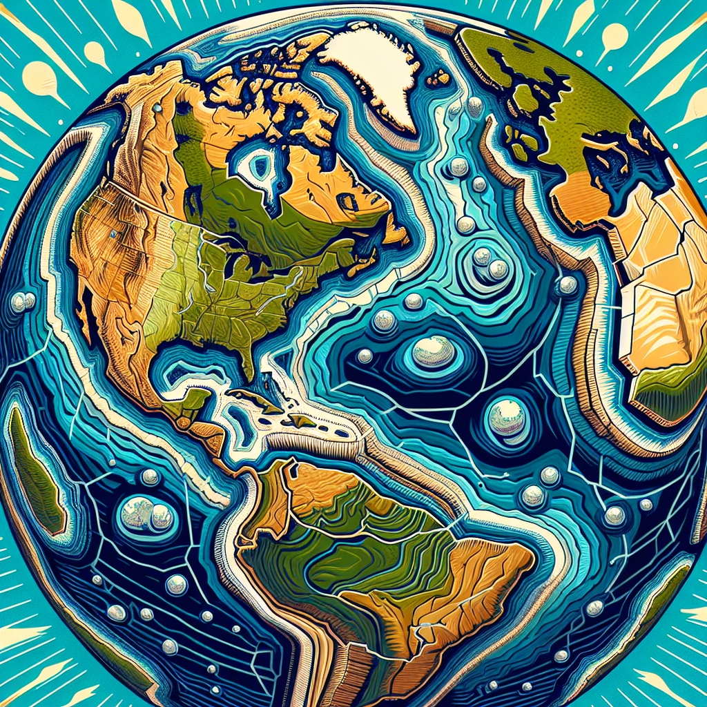
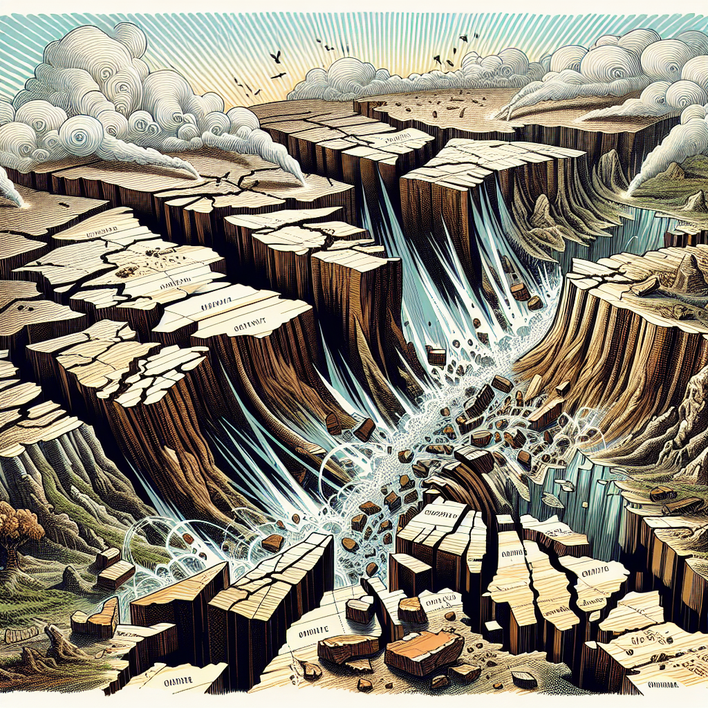
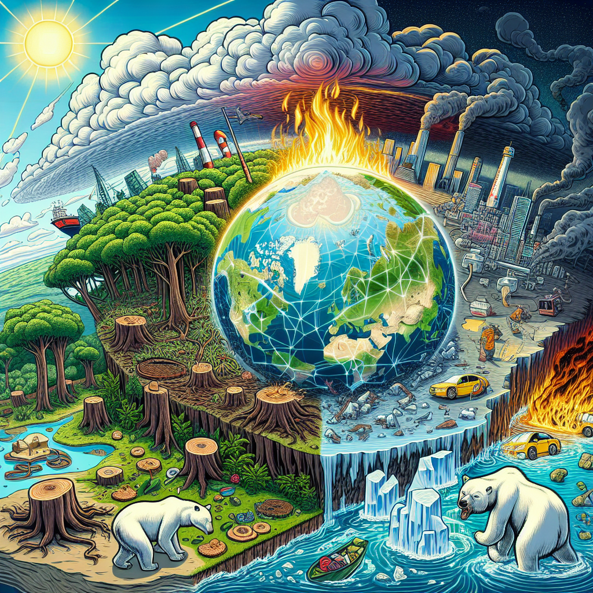
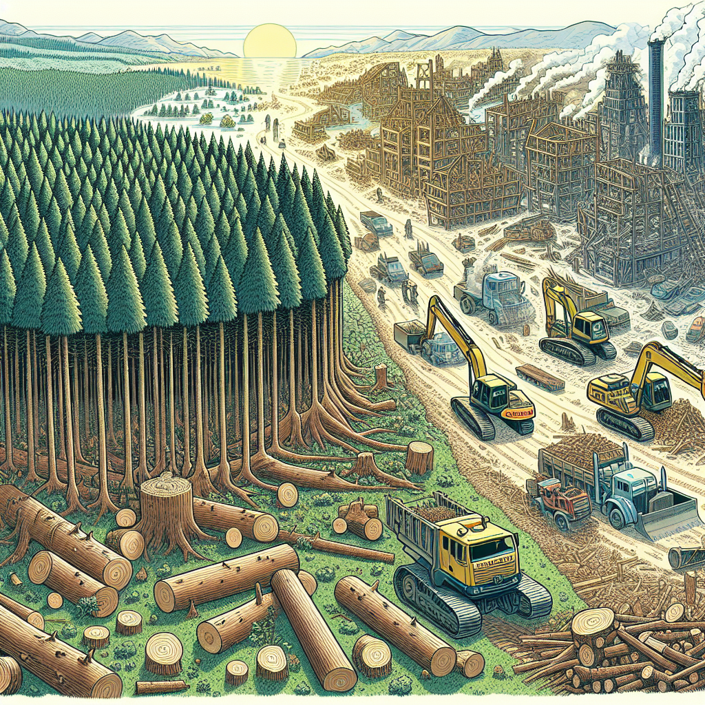

Givet avsnittet nedan, försök komma på olika upptäckter som gjorts inom området, och skriv om dessa som att de ska presenteras i faktarutor.
Ta med årtal, vem eller vilka som gjorde upptäckten, kort information om hur det gick till.

Tänk på att en och samma upptäckt kan ha gjorts flera gånger oberoende av varandra.
Exempelvis, om Pytagoras sats lyfts fram som en av upptäckterna på området, nämn även Babyloniernas och Egypternas tidigare kunskaper 

Här är avsnittet för vilket du ska komma på upptäckter: 
-----
# Jordens förändring

Jorden är en dynamisk planet som ständigt förändras. Dessa förändringar sker både långsamt och snabbt, beroende på vilka processer som styr dem. I detta kapitel kommer vi att utforska de olika aspekterna av hur jorden förändras, inklusive geologiska processer, klimatförändringar och människans påverkan.

För att förstå hur jorden förändras är det viktigt att få en inblick i de krafter och processer som ligger bakom dessa förändringar. 

## Geologiska processer

Geologiska processer är de naturliga rörelser och omvandlingar som formar jordens yta över miljontals år. Dessa inkluderar kontinentaldrift, vulkanism, erosion och jordbävningar. 

**Kontinentaldrift** refererar till rörelsen hos jordens kontinenter. Jorden är uppdelad i flera stora plattor, kända som tektoniska plattor, som flyter på det halvflytande manteln under skorpan. [] Dessa plattor rör sig ständigt, om än väldigt långsamt, vilket kan leda till bildandet av bergskedjor eller orsaka jordbävningar när de plattor kolliderar eller glider förbi varandra.

**Vulkanism** sker när magma från jordens inre tränger upp genom skorpans sprickor och bildar vulkaner. Vulkanutbrott kan dramatiskt förändra landskapet och skapa nya landformer som öar och berg. 

**Erosion** innebär att jord och sten bryts ner och flyttas av naturliga krafter som vind, vatten och is. Det formar landskapet över tid, exempelvis genom att skapa dalar eller strandlinjer.

**Jordbävningar** är litosfärens snabba skakningar som sker när spänningarna i jordens skorpas plattor släpps. [] Dessa kan orsaka förändringar i landformen och påverka byggnader och ekosystem.

## Klimatförändringar

Klimatförändringar refererar till långsiktiga förändringar i jordens klimat, inklusive genomsnittliga temperaturer och vädermönster. 

Det naturliga klimatsystemet består av atmosfär, hydrosfär, kryosfär, biosfär och geosfär. Dessa system påverkar varandra och kan leda till klimatförändringar. En pågående and diskussion och forskning handlar om hur mycket människors aktiviteter påverkar klimatet.

Den globala uppvärmningen är en betydande klimatförändring som många forskare anser orsakas av mänsklig verksamhet, såsom förbränning av fossila bränslen, avverkning av skogar och landanvändning. 

[] Effekterna av global uppvärmning inkluderar smältande polarisar, stigande havsnivåer, förändrade vädermönster, och utrotningshot mot känsliga ekosystem.

## Mänsklig påverkan

Människan har under historiens gång spelat en betydande roll i jordens förändringar. Från industrialiseringen till modern teknologi och urbanisering, vår påverkan är både direkt och indirekt.

**Urbanisering** innebär att stora mängder mark omvandlas från naturliga landskap till städer, vilket förändrar naturliga livsmiljöer och ekosystem. 

**Industriell verksamhet** och jordbruk har lett till förändringar i landskapet, utvinning av naturresurser och emissioner av växthusgaser, vilket påskyndar klimatförändringar.

**Skogsavverkning** är en betydande faktor i förändringen av jordens ekosystem. Träd fungerar som kolsänkor, som tar upp koldioxid från atmosfären. När träd avverkas frigörs denna koldioxid, vilket bidrar till global uppvärmning. 

[] Bevarande och hållbart brukande av naturresurser är därför avgörande för att minska vår påverkan på jordens förändring.

Genom att förstå dessa processer och påverkan kan vi bättre förutspå framtida förändringar och hitta sätt att mildra negativa effekter på vår planet.